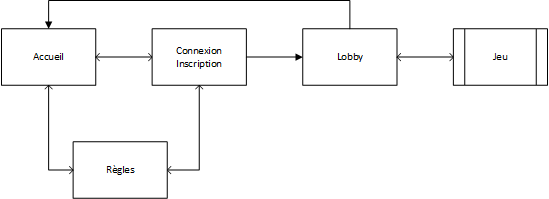
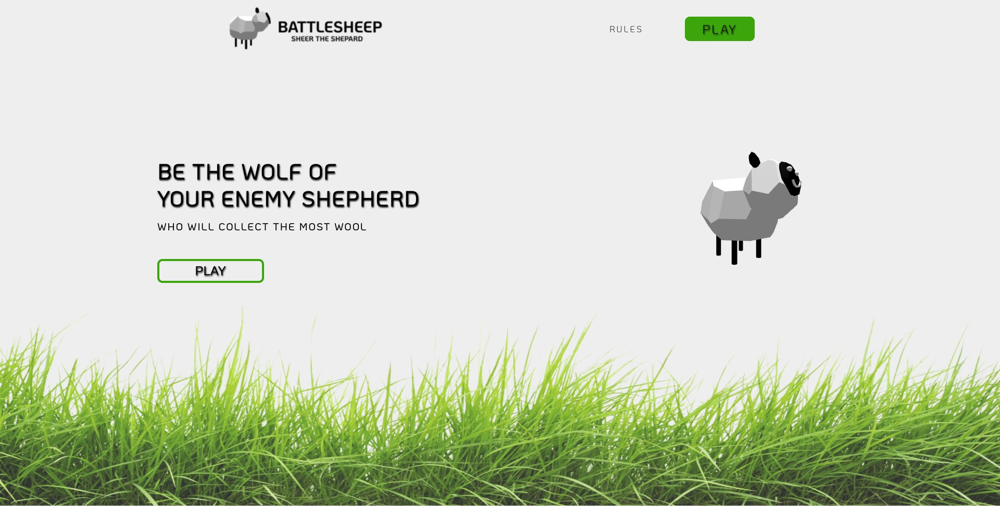
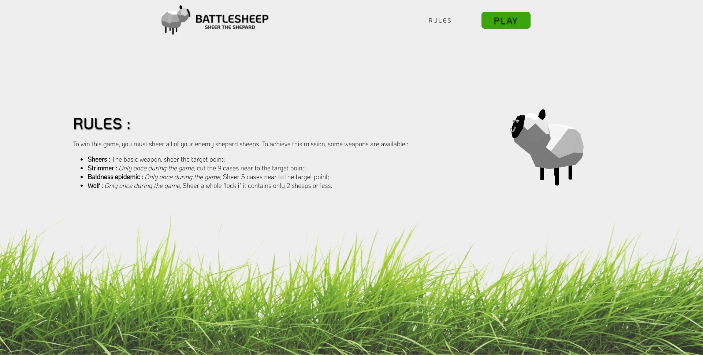
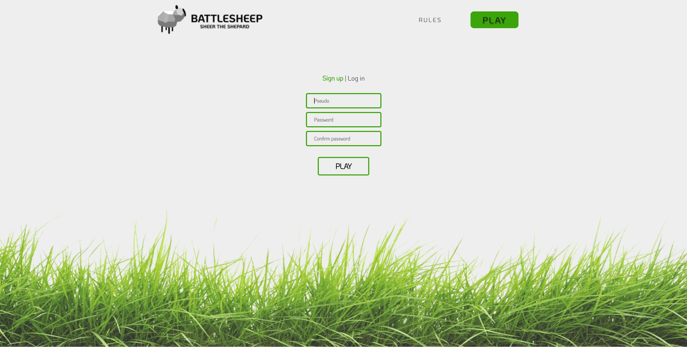
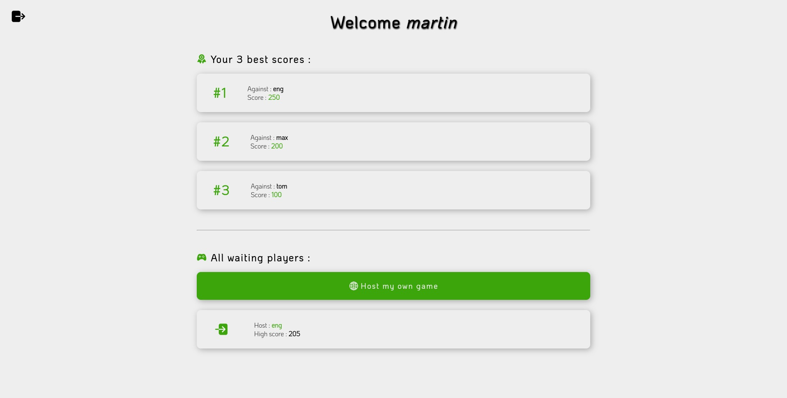
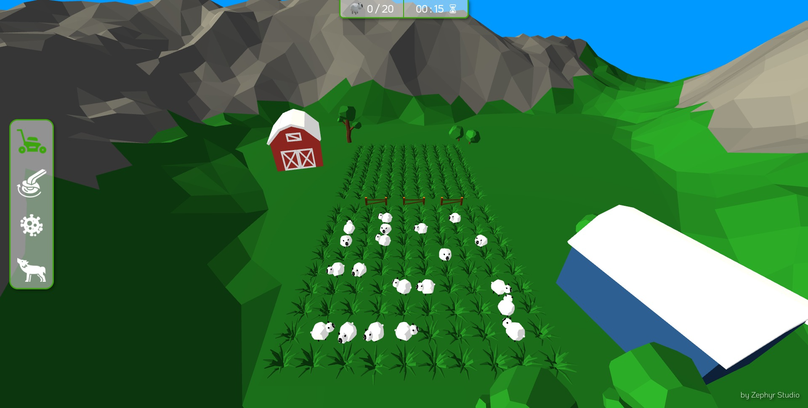
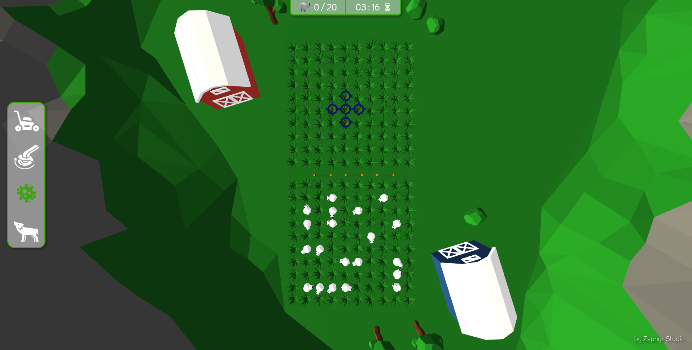

# Rapport BattleSheep

## Introduction

La vie de berger c'est plus ce que c'était ! La guerre fait rage désormais et vous n'y échapperez pas. L'attaque étant la meilleur défense, éliminez les troupeaux de votre adversaire jusqu'à ce que pénurie de laine s'en suive. Pour cela voici vos armes :

* La **tondeuse**, disponible en permanence, est une arme simple mais efficace. Elle atteint une seul case mais ne la rate pas;
* La **débroussailleuse**, disponible une seule fois dans la partie, affiche les moutons qui se cachent sous les 9 cases autour de celle cliquée;
* L'**épidémie de calvitie**, le fléau de l'homme moderne. Disponible une seule fois dans la partie, elle provoque une chute de laine sur les 5 cases autour de celle cliquée;
* Le **loup**, prédateur par excellence, est lui aussi disponible une seul fois dans la partie. Il s'occupe d'achever un troupeau de taille inférieur ou égale à 2. Cette arme fonctionne également sur les troupeaux plus grands qui ont perdu une partie de leur effectif.

Ce jeu est signé ZephyrStudio et évidement on ne fait pas les choses à moitié. Histoire de vous en mettre plein la vue, on a choisit de proposer de la 3D en lowpoly comme style graphique (on espère que ça a marché).

En parlant de ZephyrStudio, voici une petite présentation de l'équipe et de la répartition du travail :

* *Front-end*
	* **Maxime** : Il s'occupe de la sélection de la grille  du joueur au début de la partie et connecte le jeu au serveur;
	* **Martin (chef d'équipe)** : Il crée les pages web et les modèles 3D puis les mets en relation via la librairie *ThreeJS*;
* *Back-end*
	* **Enguerrand** : Il met en place le serveur *NodeJS* en capturant les requêtes *HTTP* et les connexions *WebSocket*;
	* **Tom** : Il crée la base de données et le module *NodeJS* permettant d'intéragir facilement avec elle;
	* **Rémi** : Il s'occupe des différentes sécurités et du déroulement du jeu;

#

## Front-end

### Navigation

Afin de faciliter le design du site, on a choisit de travailler avec le pré-processeur *LESS* (parce que le CSS natif ça va cinq minutes).











### Séléction de la grille

La partie commence par la sélection de la grille. 
On peut placer 10 troupeaux de moutons:

* 4 troupeaux de 1 mouton
* 3 troupeaux de 2 moutons
* 2 troupeaux de 3 moutons
* 1 troupeau de 4 moutons

Les moutons qui ne sont pas encore placés sont situés dans une barre à gauche de l'écran, à côté de la grille.

Le placement des moutons se fait par un système de drag and drop. Le joueur sélectionne un mouton dans la barre à gauche et le déplace jusqu'à la case du tableau voulu. Lorsqu'il le lâche, si le mouton a un placement convenable alors il est placé sur la grille, sinon il est remis à son ancienne position (dans la barre à gauche si le mouton n'était pas préalablement placé sur la grille sinon, à son ancienne position sur la grille).

La mise en place du drag and drop (qui m'a fait perdre trop de temps à cause d'erreurs irrecevables, je ne pouvais pas me laisser faire insulter de la sorte par une banale console, je lui apprends pas mon métier, alors elle va me laisser faire le mien, c'est qui le patron !) a pris plus de temps que prévu, notamment à cause des différents conteneurs utilisés (td du tableau, div du mouton, div de la barre des moutons, le contenu de la div du mouton). J'ai eu beaucoup d'erreurs à cause de ces conteneurs qui n'étaient pas ceux que je souhaitais viser. Une autre erreur qui m'a pris du temps est le remplissage de la grille selon la taille du troupeau de mouton. On place dans la grille un seul mouton et il faut créer et placer automatiquement à la suite le nombre de moutons correspondant à la taille du troupeau placé. Il a fallu créer de nouveaux moutons, de nouveaux blocs à placer dans les bons conteneurs (encore des erreurs d'éléments visés) et lorsqu'on choisi un mouton du troupeau à déplacer, les autres (du troupeau séléctionné) sont enlevés pour pouvoir placer le mouton à un nouvel endroit. Si on choisit un mouton dans la grille et qu'il est situé au milieu de son groupe, il devient alors le nouveau premier mouton du troupeau quand on le place à nouveau.

Le joueur à 3 boutons à droite de la grille :

* le bouton **Rotate** qui permet de changer la direction des moutons (en ligne ou en colonne), le changement de direction est effectif lorsqu'on déplace un mouton (il faut donc déplacer le mouton pour le faire pivoter et non juste cliquer dessus).
* le bouton **Reset** qui permet au joueur de recommencer sa grille. Les moutons sont recréés dans la barre à gauche et la grille redevient vierge.
* le bouton **Valid** qui permet au joueur de soumettre sa grille à la validation. Si sa grille est jugée comme incorrecte, sa grille est réaffichée, remplie avec les moutons tels qu'il les avait placés et devra la modifier. Si sa grille est correcte, la guerre avec l'autre joueur peut commencer (à moins qu'il n'est pas fini sa grille, alors le joueur patiente, mais si l'autre joueur le fait exprès parce qu'il a peur de perdre, il sait que les patates sont cuites et qu'il retarde l'affrontement final, alors l'attente sera longue jusqu'à l'abandon...).

### HUD

Sur la page de jeu, le joueur a besoin de plusieurs informations comme le nombre de moutons qu'il a touché, le temps depuis le début de la partie, ses différentes armes, etc. Pour cela nous avons mis en place un **HUD**, c'est à dire une interface en 2D affichée par dessus le jeu.

Il est manipulable via un module *JavaScript* qui permet de modifier le score, les armes déjà utilisées ou celle selectionnée, démarrer le chrono, afficher des annonces ou des GIFs. Oui oui des gifs ;)


### 3D

Ah, on arrive à la partie intéressante (bien sûr les autres ne sont pas inintéressante mais booon). Pour manipuler la 3D, on utilise la librairie *ThreeJS* qui permet d'intéragir avec *WebGL*, le système 3D des navigateurs. La mise en place d'une interface se fait donc via la création d'une scène, d'un moteur de rendu, d'une caméra, d'une ou plusieurs lumières et de tout ce que vous souhaitez y mettre. On peut y ajouter donc les modèles 3D, les textures, les formes *ThreeJS* (comme les cubes par exemple), etc.

Pour gérer tout ce joli foutoir, on a créé une classe `View` qui représente toute la vue 3D (et donc les éléments qui la compose). Comme la grille est représentée dans cette vue, il fallait obligatoirement un moyen de la manipuler facilement. Cette classe permet de :

* Charger les éléments de la scène (modèles et textures)
* Afficher la grille du joueur (après la sélection du début de partie)
* Ajouter / supprimer un élément de la grille
* Récupérer un élément de la grille à partir de sa position



En bref, cette classe fournit tout le nécéssaire pour l'intéraction avec la grille. On peut retrouver dans cette grille :

* De l'herbe, cache un mouton... ou pas;
* Des moutons classiques, ceci n'ont pas encore été touchés... Pour l'instant;
* Des moutons rasés, dommage pour eux, l'adversaire est passé par là.

Jusqu'à présent on peut donc la manipuler mais on ne peut pas encore détecter lorsque le joueur sélectionne une case. Pour cela on utilise un outil mis à disposition par la librairie : le **Raycaster**.

Comment ça marche ? C'est simple, ça trace un "rayon" là où le joueur clique puis renvoie tous les éléments que le rayon a traversé. On peut donc facilement en déduire la case cliquée (via un petit calcul mathématique) et **PAF ça fait des chocapics**. Évidement on ne s'est pas arrété là... Le simple clique n'étant pas assez ergonomique à notre gout, on a décidé de rajouter un affichage au survol. À chaque passage sur une case différente, on calcul l'impact de l'arme sélectionnée sur la case visée en affichant une cible (en 3D, évidement) au dessus des cases impactées et une croix au dessus des moutons déjà touchés.



Vous trouvez que ça manque d'animation ? De fun ? De tracteur ? Vous n'allez pas être déçu. Je vous présente le ***CAPILLOTRACTOM*** :


Nommé ainsi pour sa belle cheveulure et son joli visage, le *Capillotractom* vous fera passer de bons moments, seul ou en famille. D'un point de vue plus technique, cette belle texture est implémenter dans le jeu via une *sprite*. Il s'agit d'un élément 3D permettant d'afficher une texture 2D dans l'environnement *ThreeJS*. L'image est donc toujours orientée vers la caméra mais peut se déplacer sur tous les axes. Grâce à cela nous avons pu ajouter une animation faisant translater le *Capillotractom* à travers la grille lorsqu'un des joueurs utilise l'arme *débroussailleuse*.

Hm ! Je sens que vous n'êtes pas encore satisfait... Eh bien sachez qu'il sagit tout de même d'un jeu **Made by ZephyrStudio**. On ne fait jamais les choses à moitié ici :

**Tous les éléments 3D que vous pouvez admirer dans notre jeu ont été concoctés par nos soins** sur le logiciel *Blender* (RIP Martin).

*Bon ok c'est moche mais chuuut faut pas le dire...*

Il faut aussi préciser que le joueur peut contrôler la caméra avec les touches `Q`, `S` et `D`. Il a donc 3 angles de vue différents sur la scène.

### Sound Design

Alors... Euh... Comment dire ? On avait plus trop le temps. Petites recherches internet + un petit tour sur *Audacity* et hop le tour est joué ! Mais ça ne nous a pas empêché de faire les choses bien. Il y a donc un module appelé `SoundDesign` qui permet de lancer au moment souhaité les différents sons enregistrés :

* Un son de tracteur pour le *Capillotractom*;
* 3 sons différents pour la découverte d'un mouton qui sont joués aléatoirement à chaque fois (ils ne sont **pas du tout** inspiré de ceux de Minecraft, c'est faux).

### Mise en relation avec le back-end (HTTP + WebSocket)

Pour que le jeu puisse fonctionner, il a fallu connecter le client et le serveur. Pour cela nous avons utilisé des requêtes *HTTP* et des événements *WebSocket*. Il a donc fallu utiliser ces outils qui nous ont donné du fil à retordre. Le plus difficile a été de relier les joueurs avec le système de room et de récupérer les données de chacun afin de procéder au bon déroulement de la partie.

Les requêtes http sont utilisées lors :

* De la connexion, on envoie les données du formulaire au serveur via une requête *POST*. Il les vérifie grâce à la base de données et renvoie une réponse pour prévenir le client de ce qu'il doit faire (rediriger ou afficher une erreur);
* De l'inscription, même procédé que la connexion mais avec une procédure différente côté serveur;
* De la déconnexion, on envoie une simple requếte *POST* vers `/logout`, le serveur gère le reste.

Parce qu'on est dissident, on utilise l'API *fetch* de *JavaScript* (au lieu d'*AJAX*). L'avantage est surtout dans le fait qu'elle soit native au langage et facile à utiliser. De plus Martin avait déjà travaillé avec.

Le WebSocket est donc utilisé tout au long de la partie (dans la phase de jeu essentiellement) :

* Lors de l'actualisation de la page pour reconnecter le joueur;
* Lors de la connection du joueur dans la *room*;
* Lors de la déconnexion du joueur;
* Lorsque les 2 joueurs sont connectés pour afficher la sélection des grilles de départ;
* Pour la vérification des grilles, quand les 2 grilles sont validés pour lancer le jeu;
* A chaque fois que le joueur joue, pour vérifier le coup sur le serveur et ensuite actualiser chaque client, changer de joueur, etc;
* Savoir si une partie est terminée, montrer l'écran de fin de partie aux 2 joueurs.

## Back-end

### Base de données

**Fonctionnement de la BDD**

Pour ce jeu, il faut pouvoir gérer les données de manière efficace et rapide. On a donc opté pour une gestion en base de données (BDD) pour que ce soit plus pratique.

Dans cette BDD, on a tout d'abord gérer les utilisateurs lors de l'inscription :

* Gestion des pseudos
* Gestion des mots de passe

Par sécurité, on effectue quelques vérifications de routine afin d'éviter les injections *SQL*. Tout est géré dans une classe *NodeJS* appelée BDD, avec en méthodes toutes les actions possibles (connexion, inscription, etc...)

Par la suite, après l'inscription, on gère aussi les 3 meilleurs scores du joueur connecté, scores que l'on stocke aussi dans la base de donnée sous la forme : 

* Premier meilleur score
* Joueur contre lequel ce premier score a été effectué
* Deuxième meilleur score
* Joueur contre lequel ce deuxième score a été effectué
* Troisième meilleur score
* Joueur contre lequel ce troisième score a été effectué

Tout est récupérable depuis la base de données via la classe BDD en *NodeJS*, et les meilleurs scores sont automatiquement actualisés grâce à la méthode `refreshScore`.

**Point sécurité**

Lors de l'accès à une base de données, il faut à tout prix éviter les **injections SQL**. Par conséquent, on va donc utiliser des _prepared statements_. Ils permettent d'effectuer des requêtes SQL dynamique sans prendre le risque qu'une donnée utilisateur influe sur l'exécution de la requête. L'accès à la base de données se fait donc simplement et de manière sécurisée !

### Docker

Si on devait donner une définition de *Docker* ça serait sûrement : Construire un système de conteneurs interconnectés en pensant gagner du temps mais se rendre compte que, à part perdre un weekend entier, ça aura servi à rien... Oui oui, c'est triste. Mais bon, l'avantage c'est que la mise en place de notre projet se fait très facilement sans avoir besoin de configurer *MySQL* en amont.

**Alors comment ça marche ?** Tout d'abord il faut savoir de quel dépendance le projet a besoin. Jusque là c'est assez simple : *NodeJS* et *MySQL*. Chaque dépendance va donc être gérer par un **conteneur** indépendant (très simplement c'est une sorte de machine virtuelle mais version serveur). Malheureusement, tous ces conteneurs doivent communiquer entre eux. C'est là que *Docker Compose* entre en jeu. Cet outil permet de créer un réseau de conteneur pour qu'il puisse communiquer entre eux. Dans notre cas le serveur qui tourne dans le conteneur *NodeJS* va pouvoir effectuer des requêtes vers le serveur du conteneur *MySQL*. Parfait en somme ! Ensuite il suffit de lier le conteneur *NodeJS* aux sources du projet pour qu'il puisse lancer le serveur et donner au conteneur *MySQL* un fichier décrivant notre base de données pour qu'il puisse la construire au démarrage. On va pas rentrer dans les détails des problèmes de droit d'accès aux fichiers parce que ça nécessiterait pas mal de doliprane.

**Et comment on lance tout ce bazarre ?** Ouhla, ça nécessite un petit tuto :

1. Installer `docker` et `docker-compose` et s'assurer qu'il [fonctionne sans les droits administrateurs](https://docs.docker.com/engine/install/linux-postinstall/#manage-docker-as-a-non-root-user "Docker post-installation") (pas nécessaire sous Windows);
2. Cloner le dépôt [GitHub](https://github.com/Zephyr-Quest/BattleSheep "Dépôt GitHub");
3. Installer les modules *npm* : `npm install` (comme ça c'est fait);
4. Créer un fichier `.env` avec le contenu suivant (en modifiant les valeurs de `SESSION_SECRET` et `MYSQL_PASSWORD`) :

```env
# MySQL

MYSQL_HOST="db"
MYSQL_USERNAME="root"
MYSQL_PASSWORD="<db_password>"
DATABASE_NAME="battlesheep"

# NodeJS

APP_PORT=8080
START_CMD="node index.js"
SESSION_SECRET="<session_secret>"
```

5. Créer un fichier `pass.sql` dans le dossier `db` avec le contenu suivant (en remplaçant `<db_password>` par la valeur que vous avez défini à l'étape précédente) :

```sql
ALTER USER 'root' IDENTIFIED WITH mysql_native_password BY '<db_password>'; 
flush privileges;
```

6. Pour lancer le système il suffit maintenant de faire : `npm run docker-start`;
7. Une fois les tests terminés, il ne faut pas oublier de l'éteindre : `npm run docker-stop`.

Au final est-ce que utiliser *Docker* était vraiment nécessaire ? Sûrement pas mais ça mériterait quand même bien un point bonus non ? ;)

### Serveur HTTP

Le serveur se base sur le framework *express*, ainsi que *session* et *socket.io* principalement. D'autres modules sont également utilisés tels que *path*, *body-parser* ou *express-socket.io-session*.
Nous aborderons dans cette partie, le routage des pages du site, le système de session et redirections ainsi que les requêtes POST pour, nécessairement, l'inscription et la connexion.

**Routage des pages**

Les pages du site s'obtiennent à travers un `app.get(...)` et sont renvoyés pour la plupart avec un `res.render`. Cela nous permet, par exemple, de générer la page de lobby avec le scoreboard du joueur directement côté serveur avec le module *EJS*. 

**Requêtes POST pour connexion, inscription**

L'inscription, la connexion et le logout passent par une requête *POST*. De cette manière, nous pouvons effectuer la redirection vers la page d'accueil côté client. Cela nous permet également de pouvoir vérifier la longueur du nom d'utilisateur, de le modifier afin d'éviter les injections SQL. Il en est de même avec le mot de passe.

Lorsque les vérifications de session par *express-validator* sont bonnes, le mot de passe est hashé avec *bcrypt*, une vérification de son bon encryptage a lieu puis le nom d'utilisateur et le mot de passe cryptés sont envoyés à la base de données.  

**Session et redirection**

Lorsqu'un utilisateur s'inscrit ou se connecte, son nom d'utilisateur est enregistré dans la session (le système de token pour sécuriser la session est passé à la trappe...).

Ainsi, lorsque l'utilisateur essaie d'accéder à la page *lobby* ou *game* sans s'être connecté, il est automatiquement redirigé vers la page index.

### Serveur WebSocket

Le périple du back-end arrive à une partie rigolote : le serveur WebSocket (que nous abrégerons WS). Lorsque l'utilisateur arrive sur la page lobby, une connexion au WS est initialisée. Plusieurs vérifications sont alors faites afin de savoir s'il vient de la page de connexion ou s'il vient de quitter une partie.

Le WS utilise un système de *room*. Lorsqu'un joueur choisi de créer une partie, il crée une *room*. La *room* est nommée par un **id**, cet id est l'id + 1 de la *room* ayant le plus haut id. Lorsqu'un joueur clique sur une partie déjà créée, il rejoint la *room*. L'id de la *room* est stockée dans la session des joueurs (je vous l'accorde, ce n'est pas la manière la plus sécurisée de procéder) pour récupérer plus simplement l'id de la *room* à laquelle il faut envoyer l'évènement.

Une fois qu'une *room* est pleine, c'est à dire que 2 joueurs sont dedans, l'évènement *timeToPlay* est envoyé aux 2 joueurs de la *room*, la partie démarre !

Les joueurs positionnent leurs moutons sur la grille et appuient sur le bouton de validation. L'évènement *checkGrid* est appelé afin de vérifier que la grille est correctement remplie. Si c'est le cas, celle ci est stockée sur le serveur (on évite les petits malins qui tenterait de modifier ou voir les moutons adverses). Lorsque les 2 grilles sont vérifiées, l'heure est venue de passer aux choses sérieuses.

A chaque coup, l'évènement *playerPlayed* est appelé, il permet au joueur de tirer sur une case avec une certaine arme. C'est à ce moment là que toute les vérifications sont faites. Une fois que tout est OK et que les calculs sont fait, on envoie une actualisation de toutes les données aux clients.

La déconnexion d'un joueur pendant la partie est elle aussi gérée (et je peux vous dire que j'ai galéré). Lorsqu'un joueur rafraichit la page *game*, ou la quitte, l'évenement *disconnect* est appelé automatiquement. Cela entrainait des erreurs et bug lorsqu'il revenait sur le lobby.

Ainsi, le nom du joueur se déconnectant est stocké dans un tableau de joueur en déconnexion. Lorsqu'il arrive sur la page lobby, ce tableau est parcouru. Si le nom du joueur se trouve dedans, il quitte la *room* dans laquelle il était et son id de *room* est remit à *undefined*. Ces deux étapes étaient impossible à faire dans l'évenement *disconnect* car par définition, le client n'est plus connecté au WS, donc impossible de mettre à jour ses données. Enfin, un évènement *disconnection* est émit au joueur qui ne s'est pas déconnecté afin de le faire quitter la partie, le procédé de déconnexion pour ce joueur est exactement le même. Par principe de sécurité, l'événement *disconnection* est envoyé lorsque le joueur se déconnecte et lorsqu'il arrive sur la page *lobby*.

La mise en place du système de *room* a été également assez compliqué à mettre en place, liée en partie à la déconnexion (encore et toujours elle...). Hormis ces points, la principale difficulté résidait dans le fait que  *NodeJS* et le côté serveur était tout nouveau pour moi (Enguerrand).

### Logique du jeu + Sécurités

Il est temps d'attaquer une partie importante, la logique du jeu. Même si on a décidé de nommer les armes du jeu de manière différentes (pour coller à la cohérence du jeu), il est important de savoir qu'elles respectent toutes les règles du jeu originel. C'est à dire qu'il y a quatre armes distinctes :

- Le tir classique (qui seulement une case);
- Le radar (qui découvre une zone circulaire de 3 cases)
- La torpille (qui détruit le bateau s'il reste deux cases)
- La bombe à fragment (qui détruit une zone circulaire de 2 cases)

La réalisation de trois des fonctions de tir était trivial. Pour le tir simple, on vérifie simplement si la case touchée par le tir contient un bateau, pour le radar et la torpille, on fait un cercle de $x$ cases autour de la case touchée.

Les choses deviennent moins trivial quand on passe à la torpille. On doit vérifier que la case touchée contient un bateau et que ce dernier possède que deux cases non touchées. Pour cela, on va créer une fonction de propagation qui va s'étendre du point touché à $\pm$ la taille du bateau selon la direction donnée par l'orientation du bateau. Suite à cela, on va compter les cases qui appartiennent à ce bateau et on vérifie qu'il reste bien que deux cases non touchées. 

Mais pour que le jeu se déroule sans accroc, on doit implémenter un plugin anti-triche *plus efficace que celui d'Epic Games*. 

Tout d'abord, on doit vérifier que les joueurs ne cassent pas le jeu en posant leurs bateaux sur les mêmes cases. Pour cela, on va créer une fonction qui vérifie que les bateaux ne se superposent pas. On doit aussi vérifier que les bateaux *en vue de leur taille* ne sortent pas du plateau de jeu. 

Enfin, on va utiliser une classe `BattleSheepGame` qui nous servira à stocker et gérer la partie.

`BattleSheepGame` va être instanciée une seule fois par room, et sera utilisée pour gérer la partie. Elle va contenir les données de la partie, les joueurs, l'historique des coups, la grille de jeu, le score, le temps écoulé, etc.. 

Cette classe va contenir les méthodes qui seront appelées par le serveur pour gérer la partie. Du fait de sa déclaration côté serveur, les joueurs souhaitant faire joujou avec la console du navigateur se retrouveront face à un mur.

#

## Conclusion

En résumé, c'était un projet très intéressant, autant dans la technique que dans l'organisation. Chaque membre de l'équipe a su apporter sa contribution en surmontant les problèmes un à un (ZephyrStudio dans la place !). N'hésitez pas à nous contacter si vous souhaitez plus de détails ou si vous rencontrez des difficultés à lancer notre projet (*Docker* est un peu capricieux). On vous laisse donc profiter de notre jeu et de ses formidables GIF en espérant que notre **BattleSheep** vous plaira.