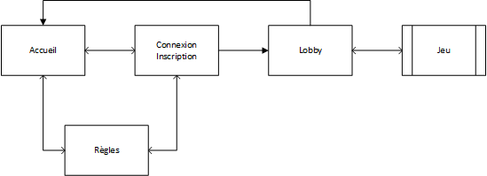
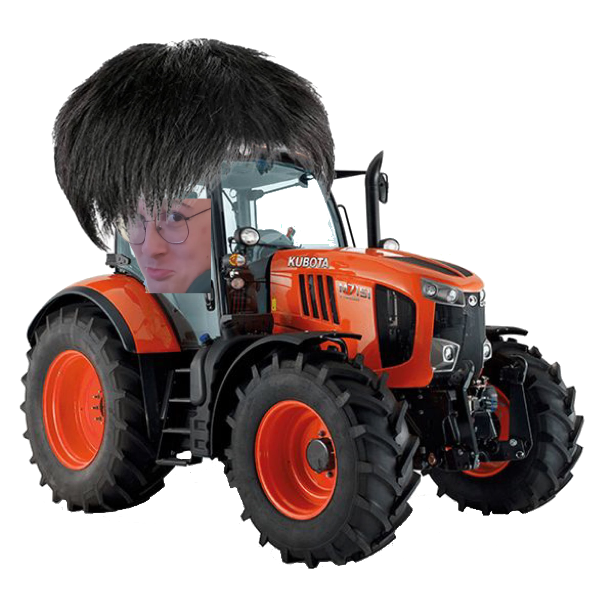

# Rapport BattleSheep

## Introduction

La vie de berger c'est plus ce que c'était ! La guerre fait rage désormais et vous n'y échapperez pas. L'attaque étant la meilleur défense, éliminez les troupeaux de votre adversaire jusque pénurie de laine s'en suive. Pour cela voici vos armes :

* La **tondeuse**, disponible en permanence, est une arme simple mais efficace. Elle atteint une seul case mais ne la rate pas;
* La **débroussailleuse**, disponible une seule fois dans la partie, affiche les moutons qui se cachent sous les 9 cases autour de celle cliquée;
* L'**épidémie de calvitie**, le fléau de l'homme moderne. Disponible une seule fois dans la partie, elle provoque une chute de laine sur les 5 cases autour de celle cliquée;
* Le **loup**, prédateur par excellence, est lui aussi disponible une seul fois dans la partie. Il s'occupe d'achever un troupeau de taille inférieur ou égale à 2. Cette arme fonctionne également sur les troupeaux plus grand qui ont perdu une partie de leur effectif.

Ce jeu est signé ZephyrStudio et évidement on ne fait pas les choses à moitié. Histoire de vous en mettre plein la vue, on a choisit de proposer de la 3D en lowpoly comme style graphique (on espère que ça a marché 😅️).

En parlant de ZephyrStudio, voici une petite présentation de l'équipe et de la répartition du travail :

* *Front-end*
	* **Maxime** : Il s'occupe de la sélection de la grille  du joueur au début de la partie et connecte le jeu au serveur;
	* **Martin (chef d'équipe)** : Il crée les pages web et les modèles 3D puis les mets en relation via la librairie *ThreeJS*;
* *Back-end*
	* **Enguerrand** : Il met en place le serveur *NodeJS* en capturant les requêtes *HTTP* et les connexions *WebSocket*;
	* **Tom** : Il crée la base de données et le module *NodeJS* permettant d'intéragir facilement avec elle;
	* **Rémi** : Il s'occupe des différentes sécurités et du déroulement du jeu;

#

## Front-end

### Navigation

Afin de faciliter le design du site, on a choisit de travailler avec le pré-processeur *LESS* (parce que le CSS natif ça va cinq minutes).

* Schéma de navigation (@RemiVan-Boxem)

	* Accueil
	* Règles
	* Connexion / Inscription
	* Lobby
	* Jeu

**Insérer des screens des pages (sauf page de jeu)**

### Séléction de la grille
@MaximeDeclemy

La partie commence par la sélection de la grille. 
On peut placer 10 groupes de moutons:
* 4 groupes de 1 mouton
* 3 groupes de 2 moutons
* 2 groupes de 3 moutons
* 1 groupe de 4 moutons

Les moutons qui ne sont pas encore placés sont situés dans une barre à gauche de l'écran à côté de la grille.

Le placement des moutons se fait par un système de drag and drop. Le joueur sélectionne un mouton dans la barre à gauche et le déplace jusqu'à la case du tableau voulu. Lorsqu'il le lâche, si le mouton a un placement convenable alors il est placé sur la grille, sinon il est remis à son ancienne position (dans la barre à gauche si le mouton n'était pas préalablement placé sur la grille, ou à son ancienne position sur la grille).

La mise en place du drag and drop (qui m'a fait perdre trop de temps à cause d'erreurs irrecevables, je ne pouvais pas me laisser faire insulter de la sorte par une banale console, je lui apprends pas mon métier, alors elle va me laisser faire le mien, c'est qui le patron !) a pris plus de temps que prévu, notamment à cause des différents conteneurs utilisés (td du tableau, div du mouton, div de la barre des moutons, le contenu de la div du mouton). J'ai eu beaucoup d'erreurs à cause de ces conteneurs qui n'étaient pas ceux que je souhaitais viser. Une autre erreur qui m'a pris du temps et le remplissage de la grille selon la taille du groupe de mouton. On place dans la grille un seul mouton et il faut créer et placer automatiquement à la suite le nombre de moutons correspondant à la taille du groupe placé. Il a fallu créer de nouveaux moutons, de nouveaux blocs à placer dans les bons conteneurs (encore des erreurs d'éléments visés) et lorsqu'on choisi un mouton du groupe à déplacer, les autres (du groupe séléctionné) sont enlevés pour pouvoir placer le mouton à un nouvel endroit. Si on choisit un mouton dans la grille et que celui est situé au milieu de son groupe, il devient alors le nouveau premier mouton du groupe quand on le place à nouveau.

Le joueur à 3 boutons à droite de la grille :
* le bouton **Rotate** qui permet de changer la direction des moutons (en ligne ou en colonne), le changement de direction est effectif lorsqu'on déplace un mouton (il faut donc déplacer le mouton pour le faire pivoter et non juste cliquer dessus).
* le bouton **Reset** qui permet au joueur de recommencer sa grille. Les moutons sont recréés dans la barre à gauche et la grille redevient vierge.
* le bouton **Valid** qui permet au joueur de soumettre sa grille à la validation. Si sa grille est jugée comme incorrecte, sa grille est réaffichée, remplie avec les moutons tels qu'il les avait placés et devra la modifier. Si sa grille est correcte, la guerre avec l'autre joueur peut commencer (à moins qu'il n'est pas fini sa grille, alors le joueur patiente, mais si l'autre joueur le fait exprès parce qu'il a peur de perdre, il sait que les patates sont cuites et qu'il retarde l'affrontement final, alors l'attente sera longue jusqu'à l'abandon...).

### Page de jeu

#### HUD

Sur la page de jeu, le joueur a besoin de plusieurs informations comme le nombre de moutons restant de son adversaire, le temps depuis le début de la partie, ses différentes armes, etc. Pour cela nous avons mis en place un **HUD**, c'est à dire une interface en 2D affichée par dessus le jeu.

Il est manipulable via un module *JavaScript* qui permet de modifier le score, les armes utilisées ou celle selectionnée, démarrer le chrono, afficher des annonces ou des GIFs (oui oui des gifs 😏️).

**GIF de Béquart**

### 3D

Ah, on arrive à la partie intéressante (bien sûr les autres ne sont pas inintéressante mais booon). Pour manipuler la 3D, on utilise la librairie *ThreeJS* qui permet d'intéragir avec *WebGL*, le système 3D des navigateurs. La mise en place d'une interface se fait donc via la création d'une scène, d'un moteur de rendu, d'une caméra, d'une ou plusieurs lumières et de tout ce que vous souhaitez y mettre. On peut y ajouter donc les modèles 3D, les textures, les formes *ThreeJS* (comme les cubes par exemple), etc.

Pour gérer tout ce joli foutoir, on a créé une classe `View` qui représente toute la vue 3D (et donc les éléments qui la compose). Comme la grille est représentée dans cette vue, il fallait obligatoirement un moyen de la manipuler facilement. Cette classe permet de :

* Charger les éléments de la scène (modèles et textures)
* Afficher la grille du joueur (après la sélection du début de partie)
* Ajouter / supprimer un élément de la grille
* Récupérer un élément de la grille à partir de sa position

**Photo de la grille en 3D**

En bref, cette classe fournit tout le nécéssaire pour l'intéraction avec la grille. On peut retrouver dans cette grille :

* De l'herbe, cache un mouton... ou pas;
* Des moutons classiques, ceci n'ont pas encore été touchés... Pour l'instant;
* Des moutons rasés, dommage pour eux, l'adversaire est passé par là.

Jusqu'à présent on peut donc la manipuler mais on ne peut pas encore détecter lorsque le joueur sélectionne une case. Pour cela on utilise un outil mis à disposition par la librairie : le **Raycaster**.

Comment ça marche ? C'est simple, ça trace un "rayon" là où le joueur clique puis renvoie tous les éléments que le rayon a traversé. On peut donc facilement en déduire la case cliquée (via un petit calcul mathématique des familles) et **PAF ça fait des chocapics**. Évidement on ne s'est pas arrété là... Le simple clique n'étant pas assez ergonomique à notre gout, on a décidé de rajouter un affichage au survol. À chaque passage sur une case différente, on calcul l'impact de l'arme sélectionnée sur la case visée en affichant une cible (en 3D, évidement) au dessus des cases impactées et une croix au dessus des moutons déjà touchés.

**Photo d'un exemple de survol (épidémie)**

Vous trouvez que ça manque d'animation ? De fun ? De tracteur ? Vous n'allez pas être déçu. Je vous présente le ***CAPILLOTRACTOM*** :

Nommé ainsi pour sa belle cheveulure et son joli visage, le *Capillotractom* vous fera passer de bons moments, seul ou en famille. D'un point de vue plus technique, cette belle texture est implémenter dans le jeu via une *sprite*. Il s'agit d'un élément 3D permettant d'afficher une texture 2D dans l'environnement *ThreeJS*. L'image est donc toujours orientée vers la caméra mais peut se déplacer sur tous les axes. Grâce à cela nous avons pu ajouter une animation faisant translater le *Capillotractom* à travers la grille lorsqu'un des joueurs utilise l'arme *débroussailleuse*.

**Photo du Capillotractom dans le jeu**

Hm ! 🤔️ Je sens que vous n'êtes pas encore satisfait... Eh bien sachez qu'il sagit tout de même d'un jeu **Made by ZephyrStudio**. On ne fait jamais les choses à moitié ici :

**Tous les éléments 3D que vous pouvez admirer dans notre jeu ont été concoctés par nos soins** sur le logiciel *Blender* (RIP Martin).

*Bon ok c'est moche mais chuuut faut pas le dire...*

### Sound Design

Alors... Euh... Comment dire ? On avait plus trop le temps 😅️. Petites recherches internet + un petit tour sur *Audacity* et hop le tour est joué ! Mais ça ne nous a pas empêché de faire les choses bien. Il y a donc un module appelé `SoundDesign` qui permet de lancer au moment souhaité les différents sons enregistrés :

* Un son de tracteur pour le *Capillotractom*;
* 3 sons différents pour la découverte d'un mouton qui sont joués aléatoirement à chaque fois (ils sont **très fortement** inspiré de ceux de Minecraft).

### Mise en relation avec le back-end (HTTP + WebSocket)
@MaximeDeclemy

* Modules fait pour intéragir avec le back (`http` + `SocketManager`)
* Difficultés rencontrées

Pour que le jeu puisse fonctionner, il a fallu connecter le front et le back. Pour selon nous avons utilisé des requêtes http et des websockets. 
Il a donc fallu utiliser ces outils qui nous ont donné du fil à retordre. Le plus difficile a été de relier les joueurs avec le système de room et de récupérer les données de chaque afin de procéder au bon déroulement de la partie (avoir quand les 2 joueurs on leur grille valide pour commencer la partie, savoir quel joueur doit jouer).

## Back-end

### Base de données
@TomMullier

### Docker
@MartDel

### Serveur HTTP
@EnguerrandMQT

* Le routage des pages du site
* Système de session et redirections
* Requêtes POST pour connexion, inscriptions, etc...
* Vérifications des données à la volée (`body`)

### Serveur WebSocket
@EnguerrandMQT

* Système de *room*
* Wallah la deconnexion jlui pisse dessus
* Difficultés rencontrées (autres que la deconnexion)

### Logique du jeu + Sécurités
@RemiVan-Boxem

Il est temps d'attaquer une partie importante, la logique du jeu. Même si on a décidé de nommer les armes du jeu de manière différentes (pour coller à la cohérence du jeu), il est important de savoir qu'elles respectent toutes les règles du jeu originel. C'est à dire qu'il y a quatre armes distinctes :
- Le tir classique (`shears`);
- Le radar (qui découvre une zone circulaire de 3 cases)
- La torpille (qui détruit le bateau s'il reste deux cases)
- Le sous-marin (qui détruit une zone circulaire de 2 cases)

La réalisation de trois des fonctions des tirs était trivial. Pour le tir simple, on vérifie simplement si la case touchée par le tir contenait un bateau, pour le radar et la torpille, on fait un cercle de $x$ cases autour de la case touchée.

Les choses deviennent moins trivial quand on passe à la torpille. On doit vérifier que la case touchée contient un bateau et que ce dernier possède que deux cases non touchées. Pour cela, on va créer une fonction de propagation qui va s'étendre du point touché à $\pm$ la taille du bateau selon la direction donnée par l'orientation du bateau. Suite à cela, on va compter les cases qui appartiennent à ce bateau et on vérifie qu'il reste bien que deux cases non touchées. 

Mais pour que le jeu se déroule sans accroc, on doit implémenter un plugin anti-triche *plus efficace que celui d'Epic Games*. 

Tout d'abord, on doit vérifier que les joueurs ne cassent pas le jeu en posant leurs bateaux sur les mêmes cases. Pour cela, on va créer une fonction qui vérifie que les bateaux ne se superposent pas. On doit aussi vérifier que les bateaux *en vue de leur taille* ne sortent pas du plateau de jeu. 

Dernièrement, on va utiliser une classe `BattleSheepGame` qui nous servira à stocker et gérer la partie.

`BattleSheepGame` va être instanciée une seule fois par room, et sera utilisée pour gérer la partie. Elle va contenir les données de la partie, les joueurs, l'historique, la grille de jeu, le score, le temps écoulé, etc.. 

Cette classe va contenir les méthodes qui seront appelées par le back-end pour gérer la partie. Du fait de sa nature back, les joueurs souhaitant faire joujou avec la console du navigateur se retrouveront face à un mur.

* Vérification grille
* Calcul impact des armes
* Représentation / Stockage d'une partie (la class `BattlesheepGame`)

#

## Conclusion
@MartDel

* C'était chaud niveau timing mais ptn on est trop fort
* Je vous laisse vous enjailler sur les petits gifs et easter eggs ;)
* Hésitez pas si vous voulez essayer de lancer le serveur et que vous galérez avec docker (hihi je maitrise un outil que le prof maitrise pas jss trop un bg)